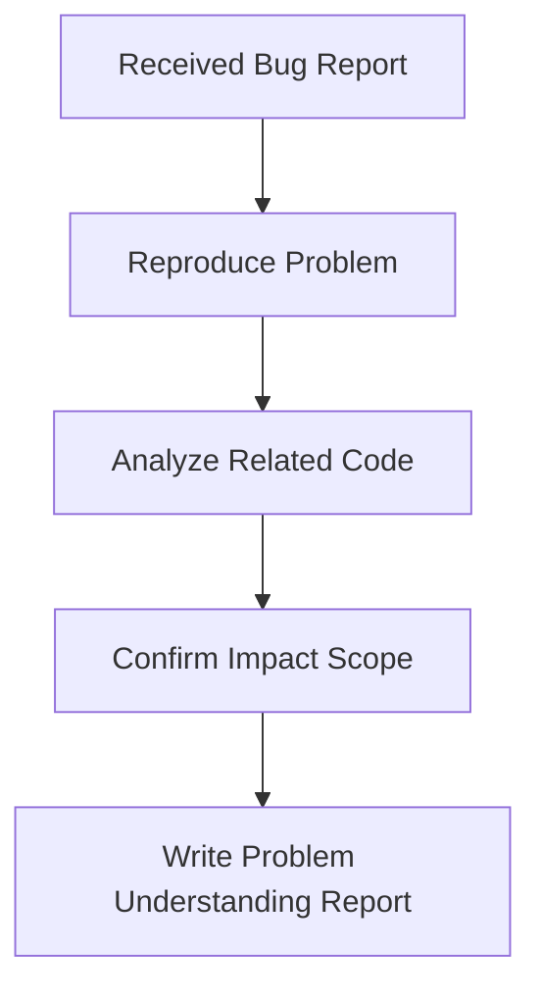
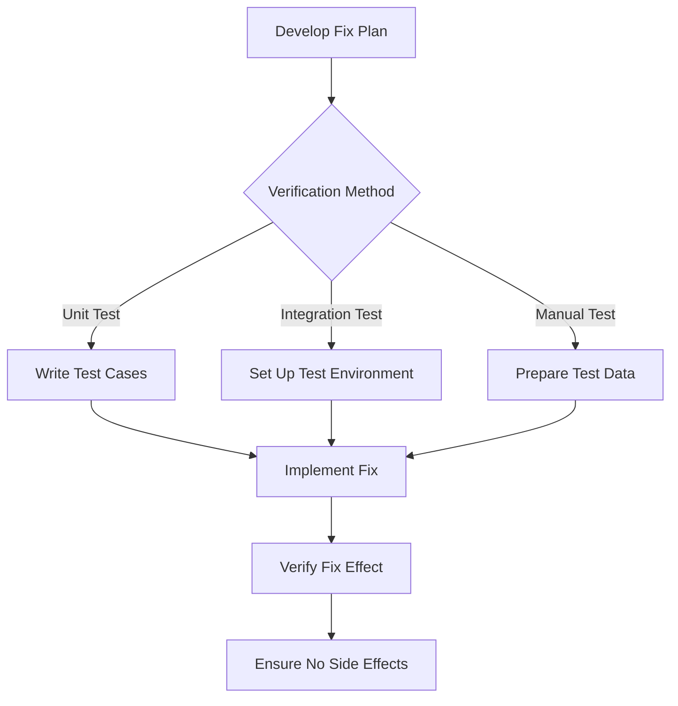
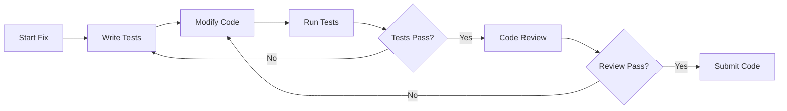
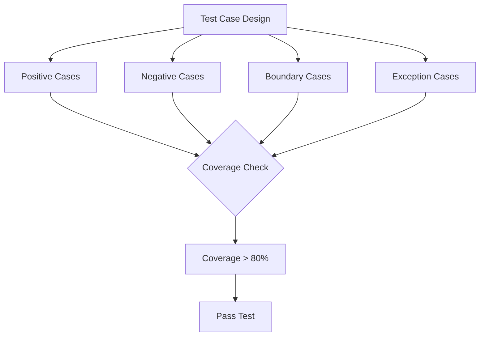
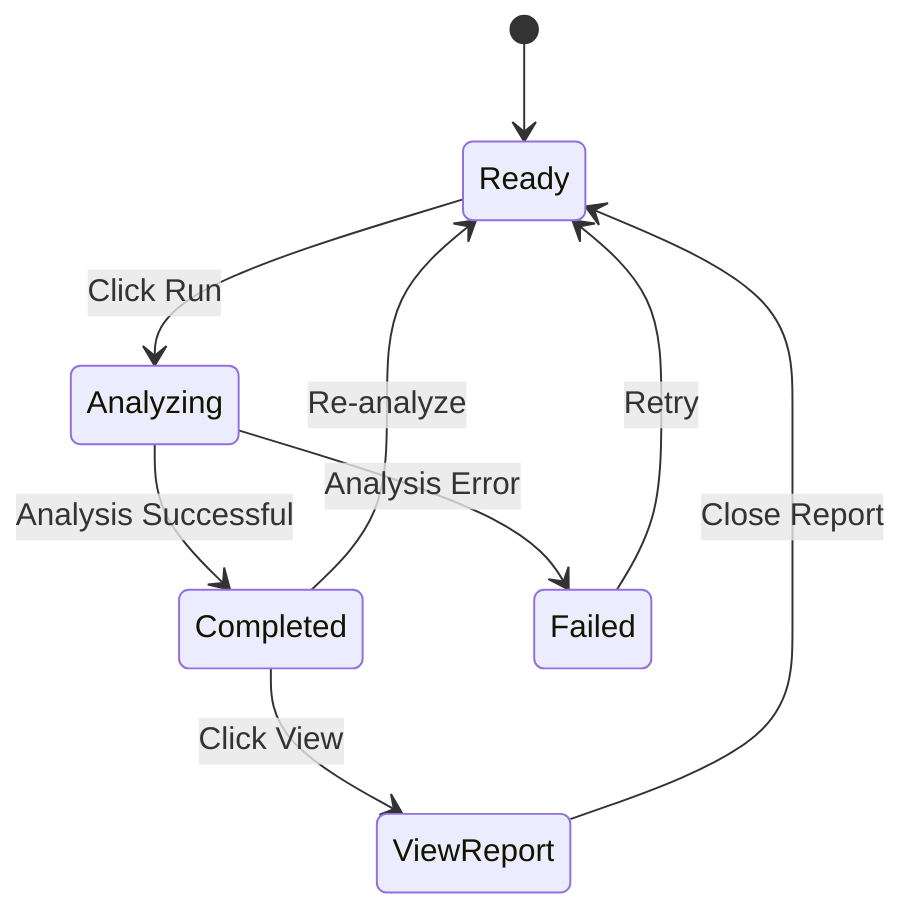
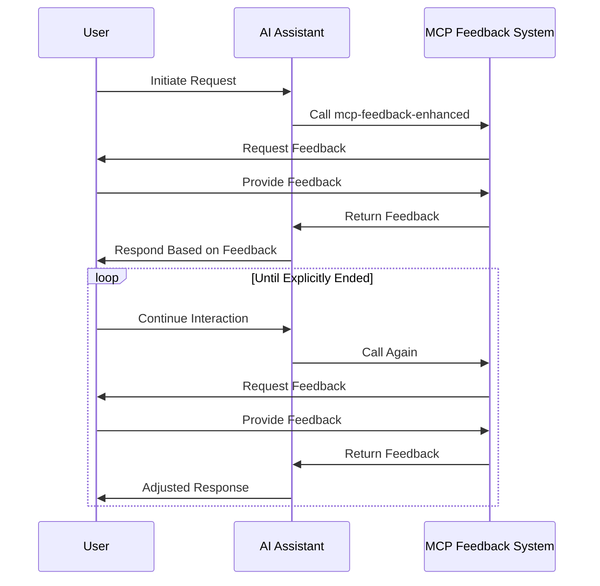
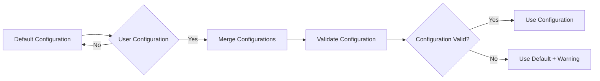
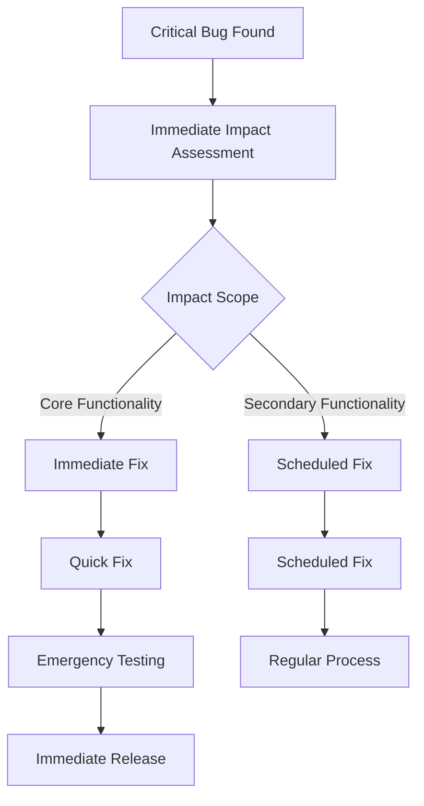

# Clang-Tidy Visualizer - Project Rules Documentation

## 🎯 General Etiquette

## Language Requirements

- All code and comments must be developed in English for internationalization

### Code Style & Quality

- Prioritize clean and easy-to-understand code that new members can quickly comprehend
- Avoid over-engineering; solve problems in the simplest way possible without predicting future requirements

### Function Design Principles

1. Functions should be small (no more than 50 lines)
2. Functions should be reusable (extract common logic)
3. Avoid duplicate code (abstract after three repetitions)

### Modular Design

- **Single Responsibility Principle**: Each module should do one thing and do it well
- **Dependency Inversion**: High-level modules should not depend on low-level modules; both should depend on abstractions
- **Open/Closed Principle**: Open for extension, closed for modification

### Communication & Collaboration

- Use plain language, avoid jargon: Explain code using easy-to-understand language
- Diagrams first: Complex logic must have flowcharts (mermaid style)
- Full understanding: Read all relevant code before making changes or explanations
- Minimal modifications: Only change what's necessary, don't touch unrelated modules

### Verification & Testing

- Must verify after changes: Consider at least 10 typical scenarios and provide expected results
- Charts must be usable: Mermaid diagrams should have correct syntax and be clear in dark theme

## 🔍 Architecture Design Rules

### Core Principles



### Module Division Rules

- Layered Architecture: UI Layer ↔ Business Layer ↔ Data Layer
- Unidirectional Data Flow: User Operation → Business Processing → Interface Update
- Event-Driven: Use VSCode event system to avoid direct coupling

## 🐛 Bug Fixing Process Rules

### 1. Understand the Problem

Must answer these questions:

- Which users does this issue affect?
- Under what conditions does it occur?
- Is there a workaround?

### 2. Analyze the Cause

At least two possible causes:

- Surface cause: Direct conditions triggering the bug
- Root cause: System design or logical flaws

Analysis tools:

- Code review
- Log analysis
- Debugging with breakpoints

### 3. Make a Plan



Fix plan requirements:

- Modify minimal code
- Don't introduce new bugs
- Have a rollback plan

### 4. Request Confirmation

Before submitting for review:

- Explain the fix idea
- Describe the modification scope
- Estimate risk level
- Request team confirmation

### 5. Execute the Fix

Follow these when coding:



### 6. Review

Self-review checklist:

- Does the code comply with standards?
- Are there performance issues?
- Are there security risks?
- Is test coverage sufficient?
- Does documentation need updating?

### 7. Explain

Must include:

- Root cause: What caused the bug
- Fix solution: How the problem was solved
- Impact scope: Which modules were modified
- Test results: How the fix was verified
- Follow-up suggestions: How to avoid similar issues

## 📊 Testing Rules

### Test Case Requirements



### 10 Must-Test Scenarios

1. Empty project: No compilation database
2. Single file: Simple C++ file
3. Multiple files: Including headers and source files
4. Third-party libraries: Including third_party directory
5. Misconfiguration: Wrong clang-tidy path
6. Large project: Over 100 files
7. Parallel execution: Multi-threading enabled
8. Fix mode: Using -fix parameter
9. Custom checks: Specifying specific checks
10. Incremental analysis: Analyzing only modified files

## 🎨 UI/UX Design Rules

### State Design Principles



### Feedback Mechanism Requirements

- Progress feedback: Long operations must have progress indicators
- Error feedback: Clearly tell users the problem cause and solution
- Success feedback: Inform users of operation results and next steps

## 🔄 MCP Interactive Feedback Rules

### Mandatory Call Rules

- Any interaction must call: Inquiry, response, and completion of phase tasks
- Must adjust based on feedback: Immediately adjust behavior based on user feedback
- Unless explicitly ended: Only stop calling when user says "end"

### Feedback Loop Process



### Phase Task Checkpoints

```mermaid
gantt
    title Task Execution and Feedback Checkpoints
    dateFormat HH:mm
    axisFormat %H:%M
    
    section Task Phases
    Requirement Understanding :crit, 00:00, 5m
    Solution Design :00:05, 10m
    Code Implementation :00:15, 20m
    Test Verification :00:35, 10m
    
    section Feedback Checkpoints
    Checkpoint 1 :00:05, 0m
    Checkpoint 2 :00:15, 0m
    Checkpoint 3 :00:35, 0m
    Final Confirmation :00:45, 0m
```



Each checkpoint must:

- Call MCP to request feedback
- Adjust direction based on feedback
- Confirm user satisfaction

## 📁 Project-Specific Rules

### Clang-Tidy Integration Rules

- Zero Python dependencies: All functions implemented in TypeScript
- Multi-format support: JSON preferred, text parsing as alternative
- Parallel processing: Multi-threading for large projects, single-threading for small projects
- Incremental analysis: Support analyzing only changed files

### Report Generation Rules

- Dark theme compatibility: All diagrams must be clearly visible in dark theme
- Interactive design: Support click-throughs, filtering
- Performance first: Large reports load paginated to avoid lag

### Configuration Management Rules



## 🚨 Emergency Handling Rules

### Critical Bug Handling Process



### Zero Tolerance for Security Vulnerabilities

- Security vulnerabilities must be addressed immediately
- Must have a solution within 24 hours
- Must be fixed and released within 48 hours

## 📝 Documentation Rules

### Code Comment Requirements

```typescript
/**
 * Execute Clang-Tidy analysis
 * 
 * @param files - List of files to analyze
 * @param options - Analysis options
 * @returns Analysis results and report
 * 
 * @example
 * ```typescript
 * const result = await runner.analyze(['main.cpp'], { checks: '*' });
 * ```
 * 
 * @throws {ClangTidyError} When clang-tidy execution fails
 * @throws {ParseError} When output parsing fails
 */
async function analyze(files: string[], options: Options): Promise<Result> {
  // Implementation code
}
```

### Project Documentation Structure

```
docs/
├── ARCHITECTURE.md     # Architecture design
├── API.md             # API documentation
├── DEVELOPMENT.md     # Development guide
├── TESTING.md         # Testing guide
└── DEPLOYMENT.md      # Deployment guide
```

## ✅ Final Check List

Check before each submission:

- [ ] Code complies with all standards
- [ ] All tests pass
- [ ] Documentation has been updated
- [ ] MCP feedback completed
- [ ] No side effects
- [ ] Performance is acceptable
- [ ] Compatibility verified

Remember: Quality is the team's responsibility, and every member is a quality guardian!
